# I. The project

The goal of this project was to discover and "play" with data from the Waymo Open Dataset: see what type of data is available, visualize the scenes, extract interesting events etc.


## I.a. The dataset

The [Waymo Open Dataset](https://waymo.com/intl/en_us/open/). was initially released for challenges revolving around prediction for self driving. Each scenario contains information about each road agent over time (position, speed etc), information about the environment where the road agents are evolving (lanes, stop signs, traffic lights etc). This data was meant to be used to train models that, given the current states and the past 1 second of states for agents in a scene, predict the motion of the agents in the next 8 seconds (see [challenges](https://waymo.com/intl/en_us/open/challenges/)). 

## I.b. My take
Because I am not an expert in planning or prediction algorithms, I decided to approach the dataset with a different angle: event extraction.
Recordings of situations like:
- cars stopping at a red light
- cars arriving at a 4 way stop sign
- etc
are very interesting to develop the 'brains' of an autonomous vehicle (whether it is to develop expert models based on rules, for fully learnt models, for hybrid models etc). So my goal was to extract some interesting events from the scenarios.

TODO python, using the protos etc

## I.c. The data
Throughout the project, I worked with the first "chunk" of data (TODO name), which contains N scenarios.

In order to understand what the scenarios look like, I started by writing a set of functions that represent the full scene as an iamge. Here are examples for what the scenes can look like:

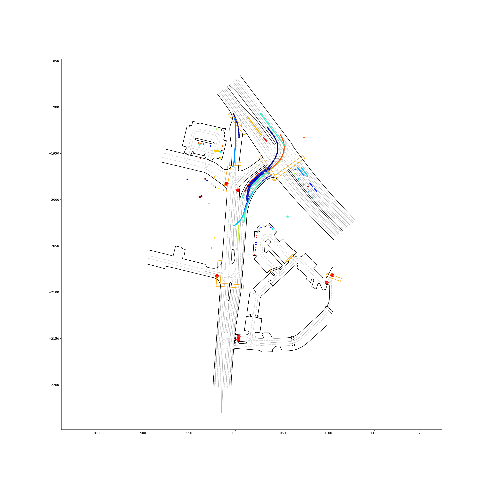
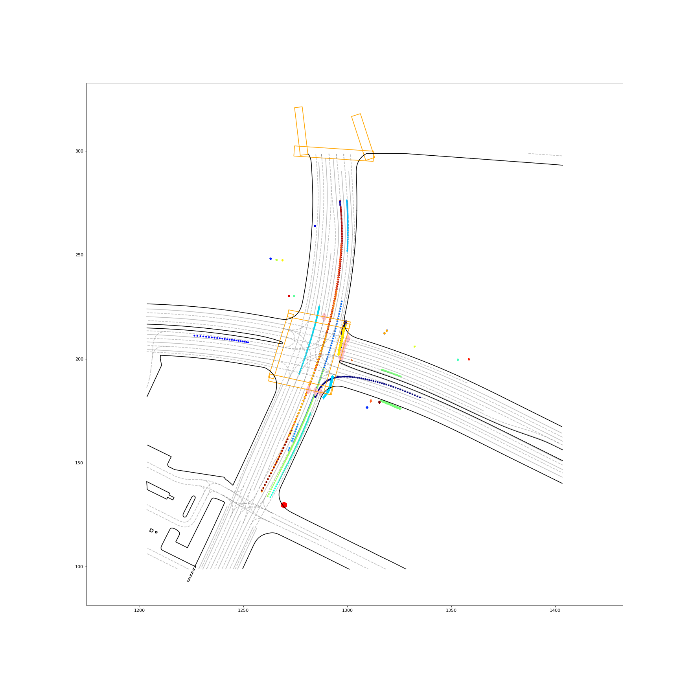
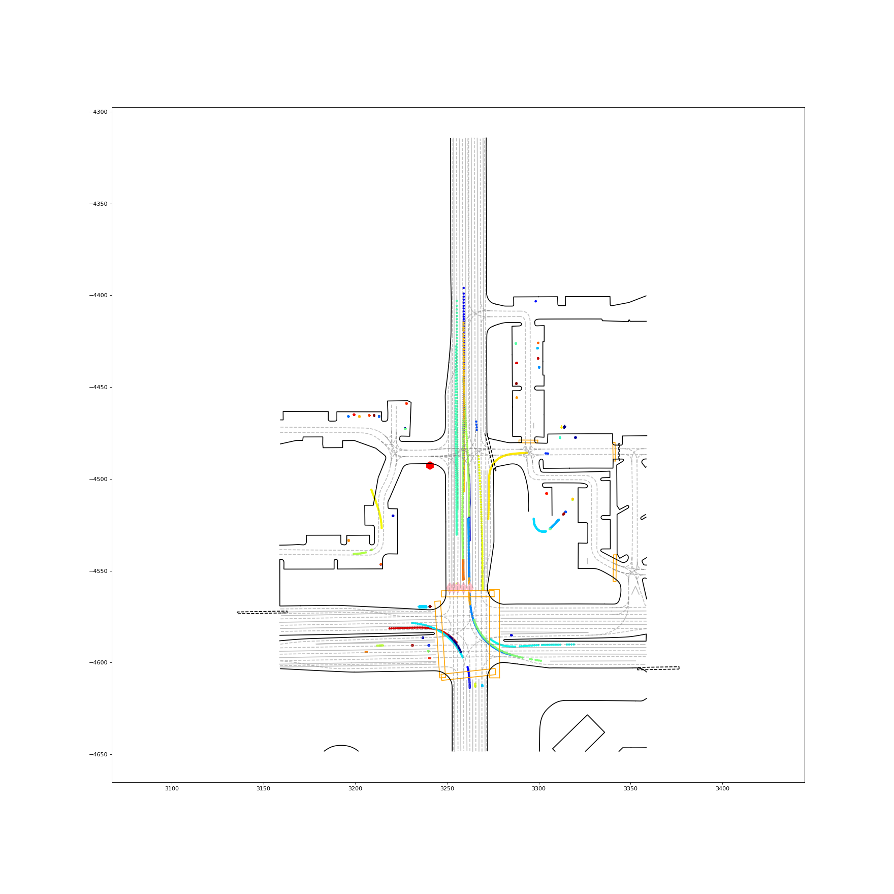

There are a lot of things going on in this urban scenario. Here is how to interpret this image:
- colored circles reprensent vehicle agents
- colored "crosses" represent cyclists
- colored "plusses" represent pedestrians
- solid black lines represent road boundaries
- sold grey lines represent road lines
- dashed gray lines represent lane centers
- grey diamonds represent traffic lights stop points
- red heagons represent stop sign stop points
- orange rectangles represent crosswalks
- dashed black rectangles represent road bumps 


These images are great to understand what a scenario looks like overall, but agents can be appear on top of each other if they happened to be at the same location at different points in time. So I wrote a set of functions to generate a video for each scenario:


TODO if the video embedding works, add some notes about tracking, the fact that the SDC "discovers" agents as they come into sight etc.

## I.d. Terminology

Here are definitions of concepts that will be frequently used in the project:
- Scene: what happened in real life at the location that was recorded by the autonomous vehicle
- Scenario: Waymo's representation of a scene
- Event: a subset of a scene, involving something _interesting_ that happened
- Road agent: a vehicle, cyclist of pedestrian in the scene
- Traffic signal: a round traffic light, or a traffic arrow
- Lane center: the virtual line in the center of a road lane, computed by Waymo
- Lane boundary: a road line or road edge element that defines the boundary of a lane, computed by Waymo
- Lane polygon: a polygon representing the extent of a lane, computed by me


# II. Finding out if agent is on a specific lane at a specific point in time

## II.a. The challenge

In the dataset, a lane is represented by its center line (the LaneCenter) and potential boundaries. TODO image This representation does not allow to say if a road agent is "on" the lane, as a human would qualify it.

One very naive way of saying if a road agent is on a lane at a given point in time would be to compute the minimum distance between the road agent's position and a point from the LaneCenter. If the distance is smaller than a threshold (for instance 6 feet, the standard half-width of a lane in the US), then the agent could be considered as on the lane. This approach is very naive in the sense it does not make use of the boundary information for each lane that Waymo provides, but also has the issue that an agent just before a lane (or just after a lane) would also be considered as "on the lane". So this approach is definitely too naive.

The representation that I decided to go for to represent lanes is a polygon. This gives us a quick and easy way to check if a vehicle is on a lane at a given time. The problem I had to solve was to, given a LaneCenter and the set of potential boundaries, generate the polygon that represents the lane.

I'll now dive into two approaches I went for: explain my methodology, their advantages and their drawbacks.

## II.b. First approach: finding the closest boundary point

In this first approach, I made use of the potential boundary info we have for each lane. Here's some pseudo code that explains it.
```
for side in [left, right]:
    for each point P in the LaneCenter:
        if there is a boundary associated with P:
            find the point from the boundary that is closest to P
            set it as polygon point associated with P
        else:
            find the LaneCenter direction at P
            find the normal to this direction
            find the point that is 6 feet away from P, along the normal
            set it as polygon point associated with P
```

Here are two examples of the results, where:
- the red line is the LaneCenter (given by Waymo)
- the blue lines are potential boundaries associated with the LaneCenter (given by Waymo)
- the orange polygon is the polygon representing the lane (computed by me)

Polygon generated for a lane whose LaneCenter does not have associated boundaries:
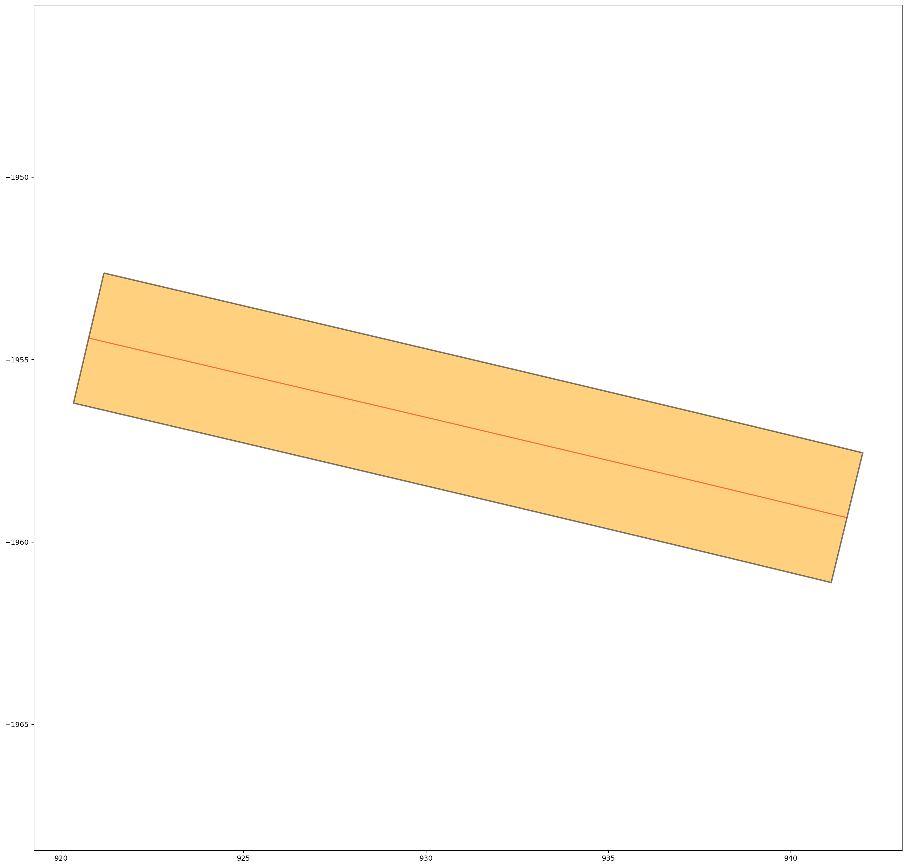

Polygon generated for a lane whose LaneCenter has associated boundaries on both sides:
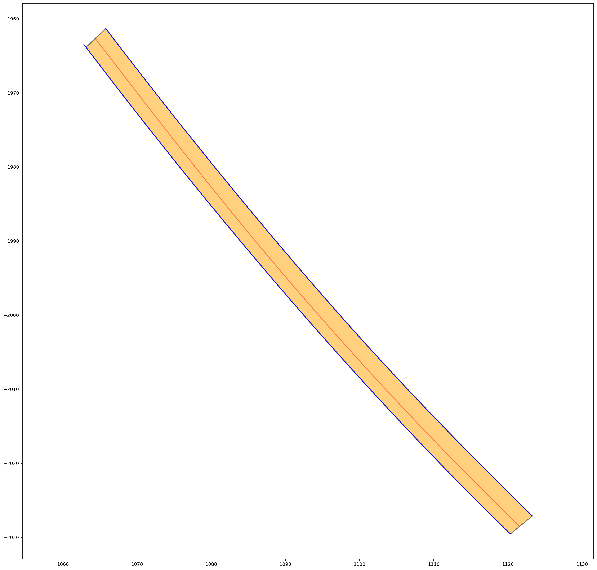

We can see a few limitations with this approach:
- The width of the lane is not very smooth: as soon as there is a boundary associated with some points from the LaneCenter, there can be a big jump in the width. Most of the time, the actual boundary is a distance close to the 6 feet assumption, but it can also be much closer or farther.
- More annoyingly, the polygon is not necessarily perpendicular to the lane direction at each of the edges. This means that, for two consecutive lanes, there could be an overlap, or a void.

In order to tackle the second limitation (and mitigate the first one), I went for a second approach with additional constraints on the polygon.

## II.c. Second approach

In this second approach, I made use of the potential boundary info we have for each lane but added some logic to enforce that the polygon point associated with a lane point is on the normal of the lane direction at this point. Here's pseudo code detailing the approach:
```
for side in [left, right]:
    for each point P in the LaneCenter:
        find the LaneCenter direction at P
        find the normal to this direction
        if we have a boundary at P:
            we find if the boundary has points on both sides of the normal
            if so:
                we compute the intersection of the line defined by these two points and the local normal
                if this point is at a reasonable distance:
                    set it as polygon point associated with P
            else:
                we project the closest boundary point on the local normal
        if we don't have a boundary:
            find the point that is 6 feet away from P, along the normal
            set it as polygon point associated with P
```

Though the high-level logic is fairly straightforward, there was a main challenge with this approach of using points from the boundary that are on either side of the normal: there can be multiple of them. As a result, the points from the boundary that need to be considered are the ones that are closest to the LaneCenter point. This is also a reason why a binary search does not really work to find the intersection points between the boundary and the local normal.

Here's the polygon associated with the lane that was problematic in the previous approach:

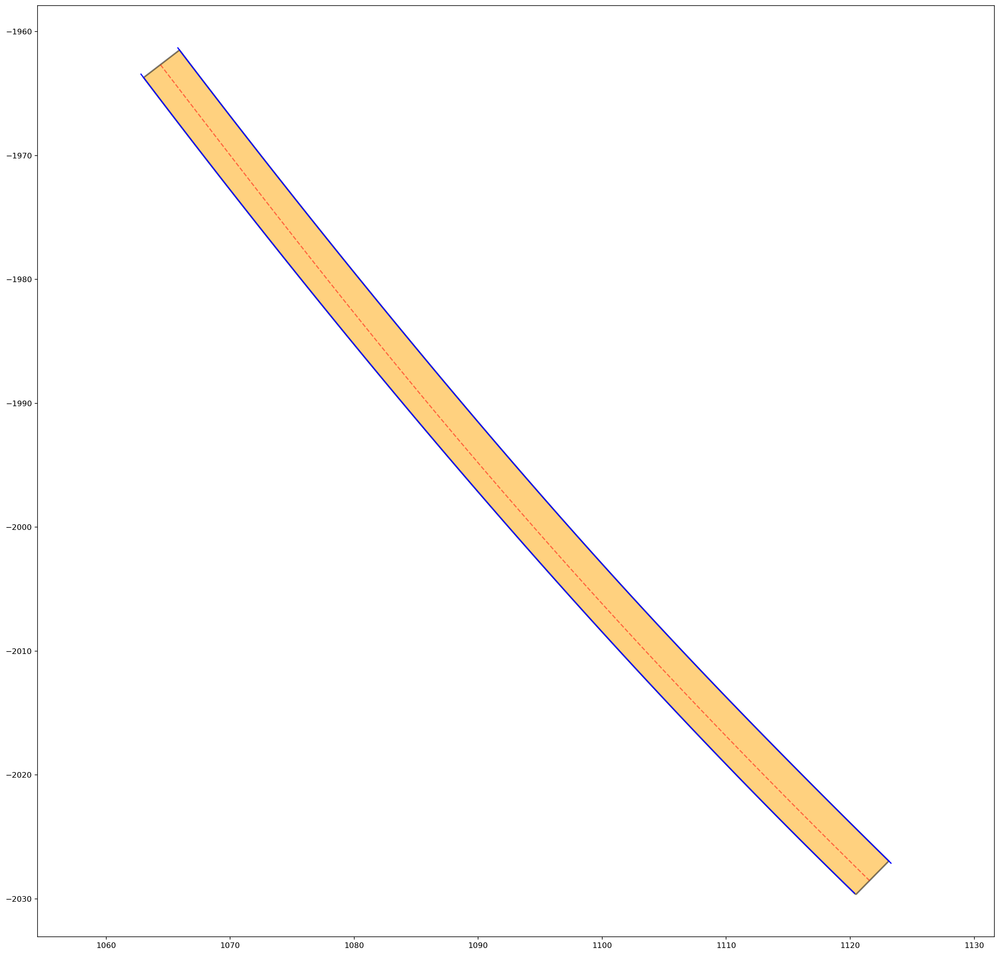

And for a more complicated situation where there are a lot of intersections between the local normals at each LaneCenter points and the boundaries:

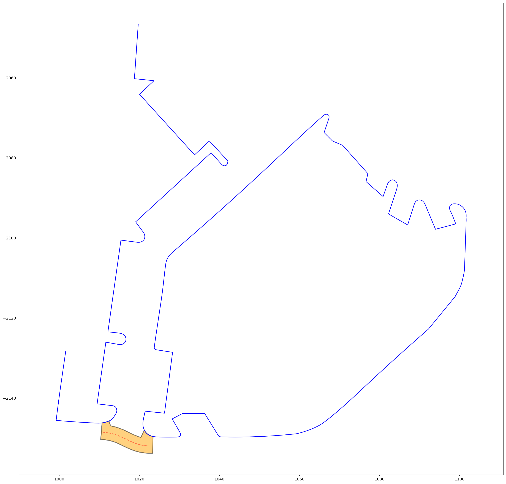


We see that now the polygon is perpendicular to the lane direction at the edges: there won't be overlap or void for consecutive lanes.
There can still be rather large jumps in the width of the lane (as we'll see later), but fewer thanks to the added logic about "reasonable" distance.

## II.d. Conclusion

The second approach succeeds in generating what I consider as "valid" lane polygons. The low smoothness of the polygons is an intrinsic characteristic of lanes in real life too.
What could be done to make them smoother is to add another step that goes over the large jumps in width and smoothes them. This would require some additional parameters (minimal jump in width to trigger the smoothig, amount of smoothing to perform etc) that, I think, would reduce the generalization ability of the polygon generation method. 

# III. Extracting scenarios related to traffic signals

## III.a. Processing lane transitions

The first thing I wanted to tackle with traffic signals is to detect transitions from a state to another. The possible states belong to 4 categories:
- `unknown` (the autonomous vehicle does not know the color of the signal)
- `go` (i.e. green signal)
- `caution` (i.e. yellow signal)
- `stop` (i.e. red signal)

It would be interesting to find scenarios where traffic signals change from one state to another, for instance to see how road agents react to a light turning yellow (under which conditions are they slowing down, stopping, driving through it etc). So I wrote a set of functions that count all transitions for a given scenario and represent them as a transition matrix.

Using this function, we can for instance find out that scenario 2 has a lot of transitions from a `go` state to a `caution` state. This information can be used to extract events of specific road agents going through the traffic signal at this specific moment.

TODO put a bit more stuff

## III.b Finding out agents who cross traffic signals

I now have all the tools to find which road agents went through a traffic signal in scenarios where interesting transitions happened. So I wrote a function that, given a scenario and a traffic signal of interest, finds road agents that go through the traffic signal.

Here's pseudo code detailing the approach:
```
find the lane L the traffic signal is associated with\
compute the polygon associated with L
if there is a successor lane M for lane L:
    compute the polygon associated with the successor lane M
else:
    generate a polygon for the fake successor lane M of lane L
find all agents that were found both is L and M in the scenario
```

The polygon for the fake successor lane M of lane L is defined as a rectangle of length 10 meters in the direction of the last point of lane L.

Here's a visualization of the results of the function for the traffic signal with ID 203 in the first scenario, where:
- the red line is the LaneCenter of each lane
- the orange polygon is the polygon representing the lane before the traffic signal stop point
- the blue polygon is the polygon representing the lane after the traffic signal stop point
- the black dots are the positions of the 2 road agents that are found to have crossed the traffic signal (agent with ID 307 and agent with ID 320)

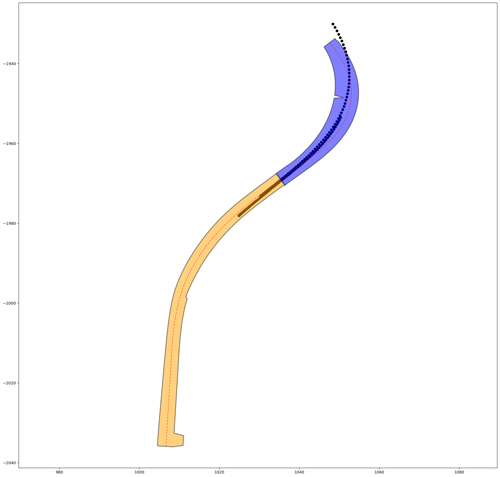

## III.d. Conclusion

TODO

# IV.Extracting scenarios related to stop signs

## IV.a. Finding agents that go through stop signs

The behavior of road agents around stop signs is also very interesting, as it is a prime example of where human drivers do not strictly follow road rules (what percentage of human drivers comes to a full stop at the painted line...?). So extracting scenarios of road agents crossing a stop sign can be very useful to tune or train behavior models.

The logic I followed to extract these scenarios is fairly similar to the logic used for the traffic signals use case. Here's pseudo code detailing the approach:
```
compute the stop point associated with the stop sign as the closest point of the associated lane L to the stop sign
if the stop point is at the beginning of the associated lane L:
    compute the polygon associated with L
    generate a polygon for the fake predecessor lane K of lane L
else if the stop point is at the end of the associated lane L:
    compute the polygon associated with L
    generate a polygon for the fake successor lane M of lane L
else:
    generate a polygon for the fake lane from the beginning of L to the stop point
    generate a polygon for the fake lane from the stop point to the end of L
find all agents that were found both is the predecessor polygon and the successor polygon
```

Here's a visualization of the results of the function for the stop sign with ID 230 in the scenario number 21, where:
- the red hexagon is the position of the stop sign (given by Waymo)
- the gray line is the LaneCenter of the lane (given by Waymo)
- the orange polygon is the polygon representing the lane section before the stop point (computed by me)
- the blue polygon is the polygon representing the lane section after the stop point (computed by me)
- the black dots are the positions of the road agent that is found to have crossed the traffic signal

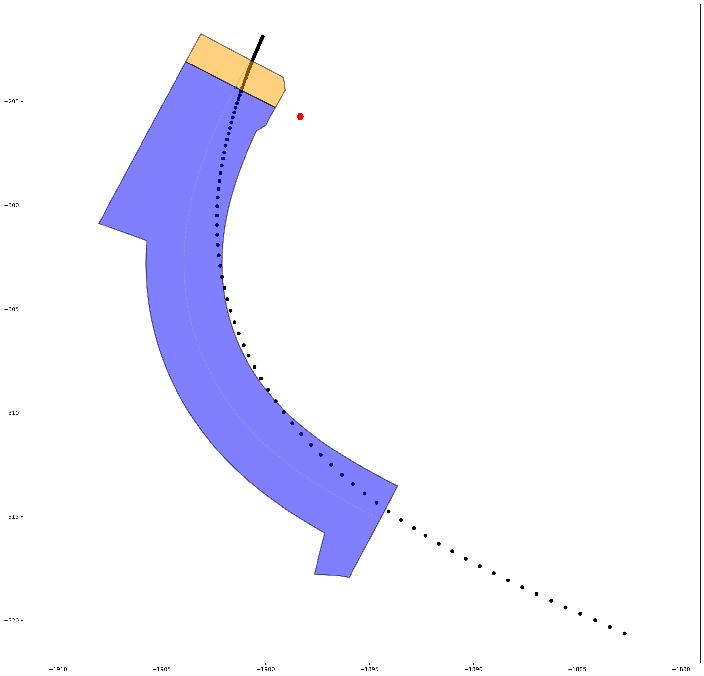

We can also plot the speed profile at every timestep for the road agent, where:
- the vertical blue line represents the timestamp at which the agent crossed the stop point
- the black "+" are the 2D speed of the road agent

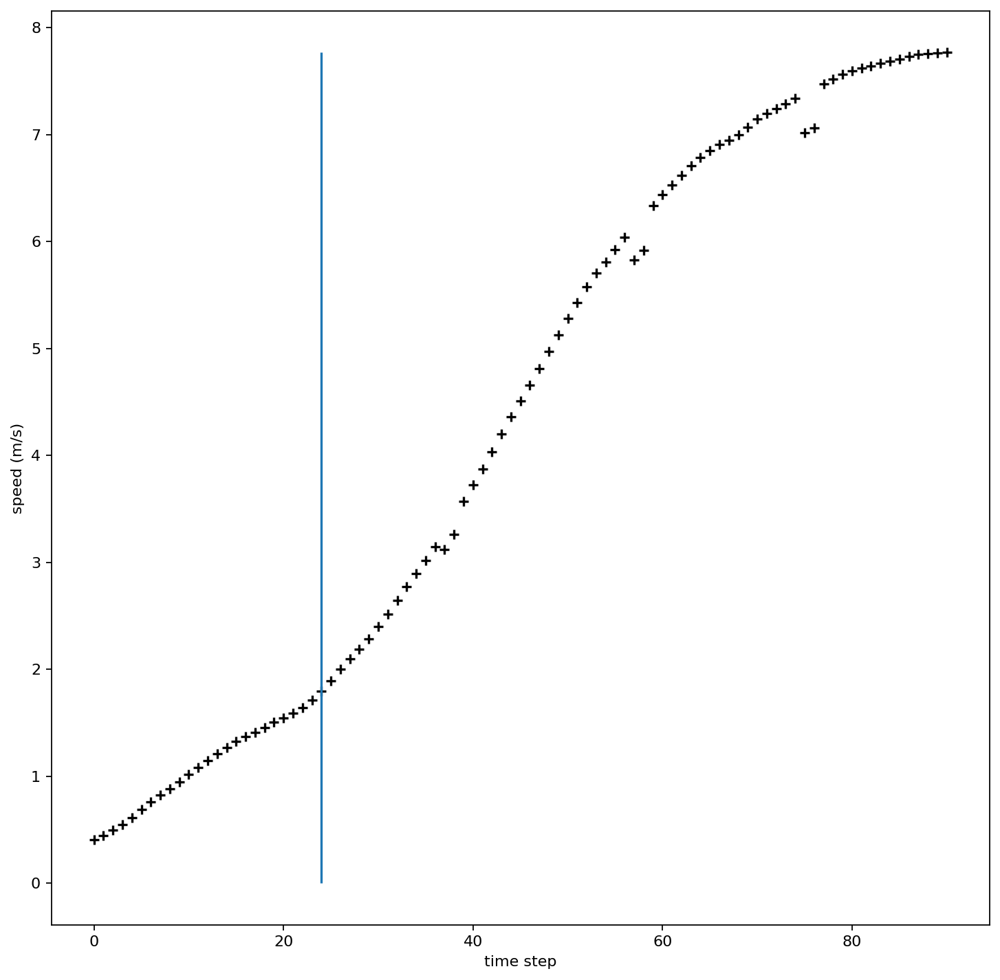

We can do the same for another stop sign where a very human behavior is found:
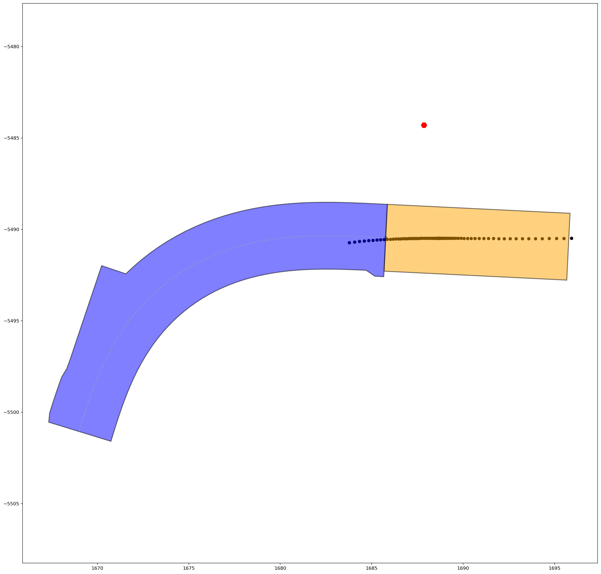
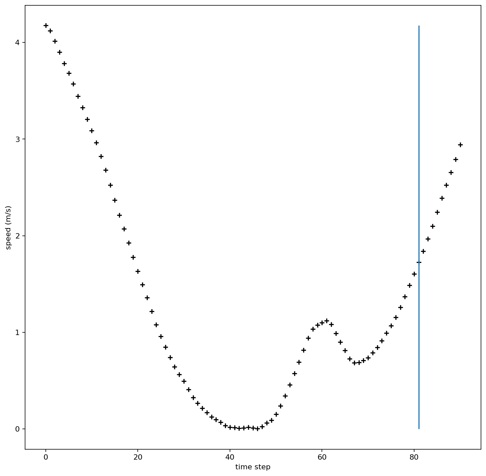

We can see that the vehicle slowed down to almost a stop, then released the brakes, then slowed down again and finally went through.

TODO if possible put the video where we see the other vehicle

TODO remark on the stop sign location being almost always before the lane, might skew the results

## IV.b. Conclusion

TODO


# V. Remarks on the data format

TODO

remarks on strange stuff in the data, what I would do differently
- not all lanes have a predecessor or successor -- makes sense but still
